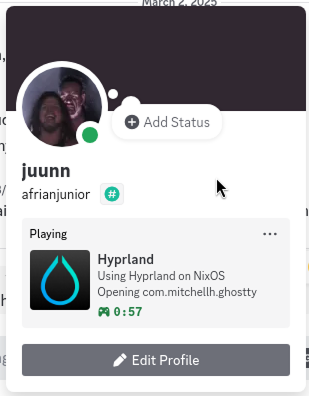

# Hyprland Discord Presence



Hyprland Discord Presence is a lightweight daemon that updates your **Discord Rich Presence** based on the currently active window in **Hyprland** (a dynamic tiling Wayland compositor). It provides real-time window tracking and can be optionally run in a streaming mode.

## Features

- ✅ **Automatic Window Tracking** – Updates your Discord status based on active windows.
- ✅ **Efficient Event Listener** – Uses Hyprland's IPC socket instead of brute-force polling.
- ✅ **Debounced Updates** – Reduces unnecessary Discord API calls.
- ✅ **NixOS-Friendly** – Easily deployable as a NixOS systemd service.
- ✅ **Optional Streaming Mode** – Use `--use-stream-window` flag to enable real-time tracking.

## Installation & Usage

### 1. Clone and Build
```sh
git clone https://github.com/your-username/hyprland-discord-presence.git
cd hyprland-discord-presence
go build -o hypr-discord-presence
```

### 2. Run Manually
```sh
./hypr-discord-presence --use-stream-window
```

### 3. Install as a Systemd Service (NixOS)
Edit `/etc/nixos/configuration.nix` and add:
```nix
systemd.services.hypr-discord-presence = {
  description = "Hyprland Discord Presence Daemon";
  after = [ "network.target" "graphical-session.target" ];
  wantedBy = [ "default.target" ];
  serviceConfig = {
    ExecStart = "/path/to/hypr-discord-presence --use-stream-window";
    Restart = "always";
    RestartSec = 3;
    User = "your-username";
    Environment = [
      "XDG_RUNTIME_DIR=/run/user/1000"
      "DISPLAY=:0"
      "WAYLAND_DISPLAY=wayland-1"
    ];
  };
};
```
Then apply changes with:
```sh
sudo nixos-rebuild switch
```

## License
📜 MIT License


